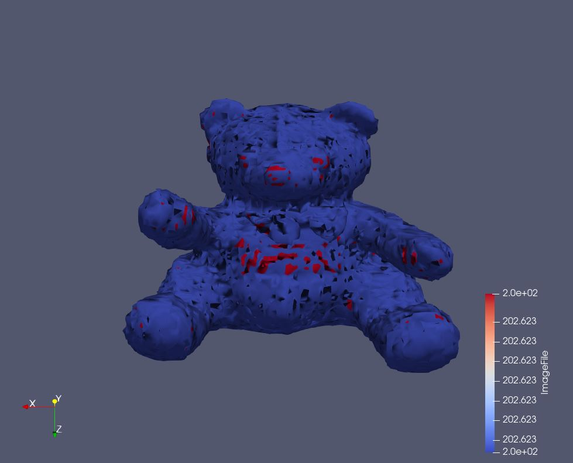
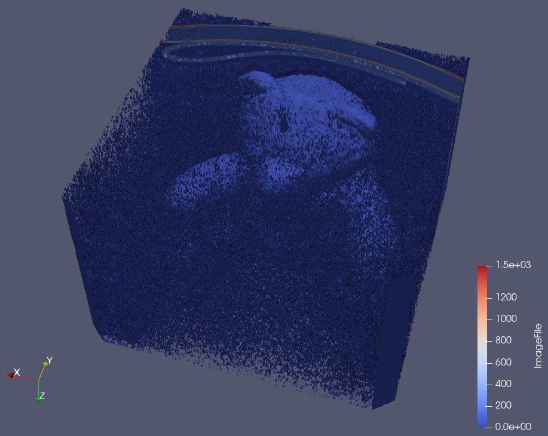
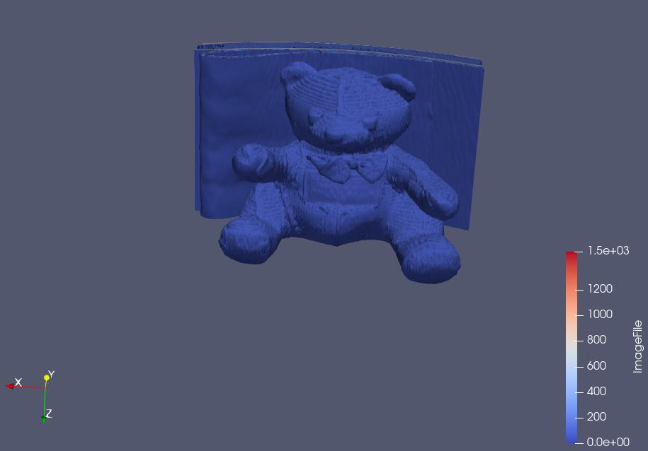
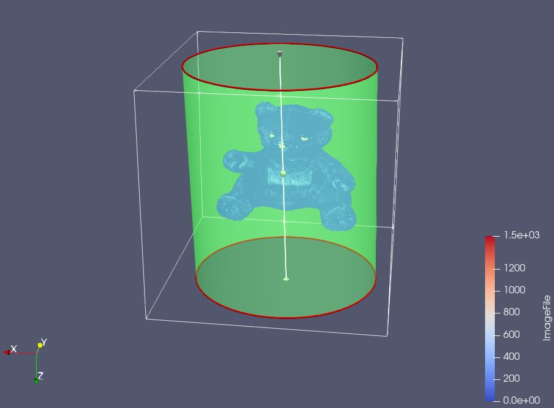

# Aim
The aim of this visualization is to explore the given data using techniques of volumne visualization to find interesting and meaningful visualization. 

# Visual Design Type
Volume Visualization showing narrowed down or filtered view of the hidden data(teddy bear) using marching cubes.

# Visualization

3D render of an object(teddy bear) with volume/density map

# Visual Mappings
### Legends

 

 | Mapping  | Range |
| ------------- |:-------------:| 
 | High  |  |
 | Medium  |  |
 | Low  |  |

  

 # Data Preparation 

We need to explore the dataset and find the hidden pattern in it. We take the below steps to achieve this.
1. Load the dataset and specify the Data Extent in properties window with respresentation as "Surface". The values used for Data Etent as listed below.
 

    | Property | Value: |
    | ------------- |:-------------:| 
    | X | 511 |
    | Y | 511 |
    | Z | 62 |

 

2. We apply the `Contour filter` to find the iso surfaces in the dataset with a `Linear Series` of `10 data points` with range `[0,1492]`, however this would result in a very noisy result which need to be filtered further. A short summary below of the setting is below.
 

    | Property | Value |
    | ------------- |:-------------:| 
    | Sample size | 10 |
    | Range | 0 - 1492 |
    |  Type | Linear |
    |  Compute Normals | Y |
    |  Compute Gradients | N |
    |  Compute Scalars | Y |
    |  Compute Triangles | Y |
    |  Representation | Surface |

 

This resulted in the below image

3. Next we apply the `Threshold filter` to find out the scalar which lie in the range(50-1000), this parameter needs to be selected carefully yo obtain the desired result.
 

    | Property | Value |
    | ------------- |:-------------:| 
    | Scalars | ImageFile |
    | Minimum | 50 |
    |  Maximum | 1000 |
    |  All Scalars | Y |
    |  Use Continious Cell Range | Y |
    |  Invert | N |
    |  Representation | Surface |

 

This resulted in the below image

4. Once we have the clear picture of the hidden object in the dataset, we apply a `Clipping filter` along the `z-axis` to clip out the obejct from background. Leaving the needed datat to visualize the subject. We used a `Cylinderical clip` type oriented in a manner to extract the desired data from the dataset.
 

| Property        | Value     |      
| ------------- |:-------------:| 
| Clip type   | Cylinder | 
| Parameters   |  <table><tr> <td>Center</td><td>`(241.99, 168.68, 147.55)`</td></tr><tr> <td>Axis</td><td>`(-0.029,0.009,0.999)`</td></tr><tr> <td>Radius</td><td>258.693</td></tr></table> |
| Invert   | Y | 
| Crincle Clip   | N | 
 

This resulted in the below image

# Improvements
1. This visualization is limited to the representation of object in the dataset. It can be improved with addition of pressure and stress values at points which can be visualized along the dataset to provide a better visualization.
2. There are no distinctive results that can be inferred from dataset, perhaps having a more colourful image would have better inferences and be more applealing.
3. We have ignored the back side of the object, it appears to be some sort of plane on which the object was placed, it could be explored more to find interesting inferences.