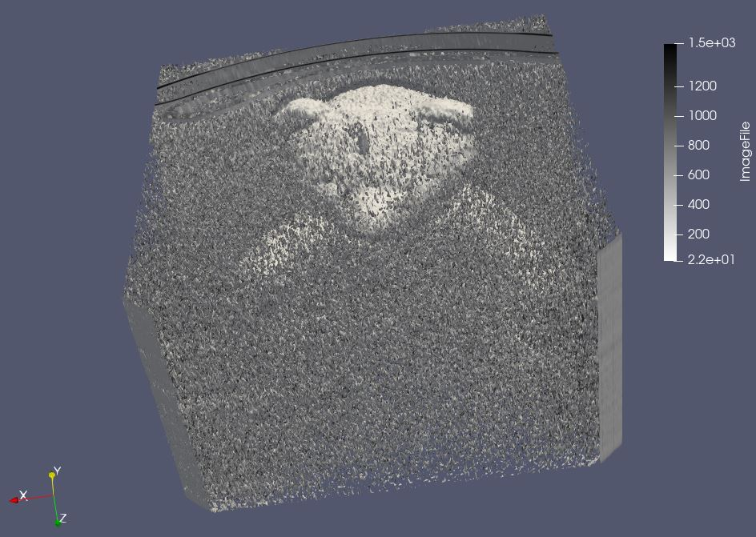

# Aim
The aim of this visualization is to explore the given data using techniques of volumne visualization to find interesting and meaningful visualization. 

# Visual Design Type
Volume Visualization showing the position/context of the object within the raw dataset `data1`.

# Visualization

Volume render of an object(teddy bear) in the given dataset which gives the relationship between the object and it surroundings.

# Visual Mappings
## Legends

 

 | Mapping  | Range |
| ------------- |:-------------:| 
 | High  |  |
 | Medium  |  |
 | Low  |  |
 | Non Empty Space  |  |
 | Empty Space  |  |

  

## Color Map
Two color maps presets have been used in this visualization both used in conjuction provide an accurate depiction of the object and the space around it.
1. `Cool to Warm` preset to map out the surrounding dataset
2. `X Ray` preset to map the object within the dataset.

 # Data Preparation 

We need to explore the dataset and find the hidden pattern in it. We take the below steps to achieve this.
1. Load the dataset and specify the Data Extent in properties window with respresentation as `volume`. The values used for Data Extent as listed below. To cater for the size of object, we have increased the `data spacing` to 5.
`Colormap` used is `cool to warm` preset.
 

    | Property | Value: |
    | ------------- |:-------------:| 
    | X | 511 |
    | Y | 511 |
    | Z | 62 |
    | Data Axes Grid | Y |
    | Read As Image Stack | Y |
    | Scalar Opacity Unit Distance | 3.108 |
    | Parameters   |  <table><tr> <td>Data Origin</td><td>(0, 0, 0)</td></tr><tr> <td>Data Spacing</td><td>`(1,1,5)`</td></tr></table> |

 
produced the below image

2. We apply the `Contour filter` to find the iso surfaces in the dataset with a `Linear Series` of `10 data points` with range `[0,1492]`, however this would result in a very noisy image, which need to be filtered further. A short summary below of the setting is below.
`Colormap` used is `X Ray` preset.
 

    | Property | Value |
    | ------------- |:-------------:| 
    | Sample size | 10 |
    | Range | 0 - 1492 |
    |  Type | Linear |
    |  Compute Normals | Y |
    |  Compute Gradients | N |
    |  Compute Scalars | Y |
    |  Compute Triangles | Y |
    |  Representation | Surface |
    | Data Axes Grid | N |

 

This resulted in the below image

3. Next we apply the `Threshold filter` to find out the scalar which lie in the range(50-1000), this parameter needs to be selected carefully yo obtain the desired result.
`Colormap` used is `X Ray` preset.
 

    | Property | Value |
    | ------------- |:-------------:| 
    | Scalars | ImageFile |
    | Minimum | 50 |
    |  Maximum | 1000 |
    |  All Scalars | Y |
    |  Use Continious Cell Range | Y |
    |  Invert | N |
    |  Representation | Surface |

 

This resulted in the below image

4. Once we have the clear picture of the hidden object in the dataset, we apply a `Clipping filter` along the `z-axis` to clip out the obejct from background. Leaving the needed datat to visualize the subject. We used a `Cylinderical clip` type oriented in a manner to extract the desired data from the dataset.
 

| Property        | Value     |      
| ------------- |:-------------:| 
| Clip type   | Cylinder | 
| Parameters   |  <table><tr> <td>Center</td><td>`(241.99, 168.68, 147.55)`</td></tr><tr> <td>Axis</td><td>`(-0.029,0.009,0.999)`</td></tr><tr> <td>Radius</td><td>258.693</td></tr></table> |
| Invert   | Y | 
| Crincle Clip   | N | 
 

This resulted in the below image

5. We then combine the dataset from data load and from the Clipping by making both visible which would give us the final result.

# Improvements
1. This visualization is limited to the representation of object in the dataset. It can be improved with addition of pressure and stress values at points which can be visualized along the dataset to provide a better visualization.
2. There are no distinctive results that can be inferred from dataset other than the object itself, perhaps having a more colourful image would have better inferences and be more applealing to eye.