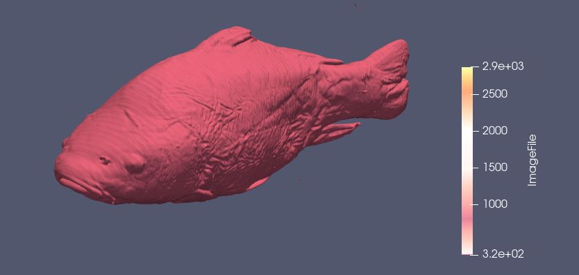
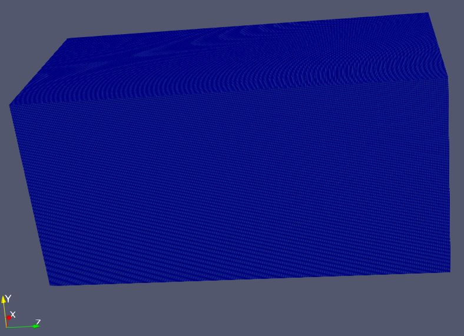
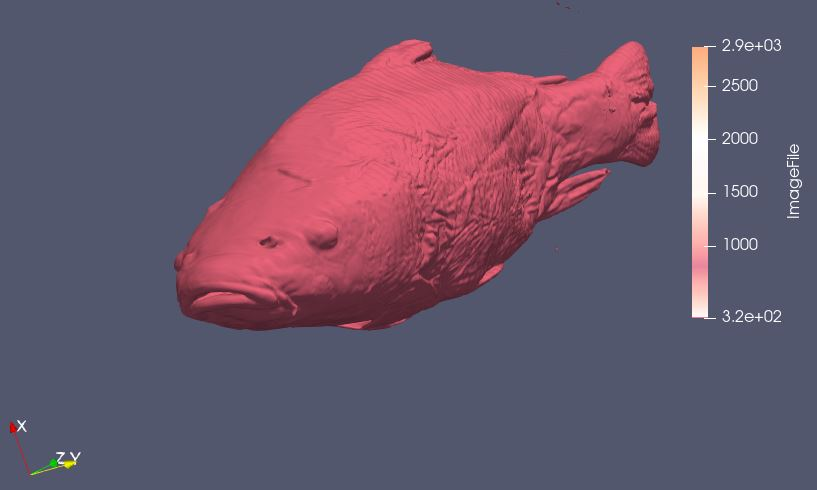

# Aim
The aim of this visualization is to explore the given data using techniques of volumne visualization to find interesting and meaningful visualization. 

# Visual Design Type
Volume Visualization showing the object within the raw dataset data2.

# Visualization

Volume render of an object(fish) in the given dataset.

# Visual Mappings
## Legends

 

 | Mapping  | Range |
| ------------- |:-------------:| 
 | Bone |  |
 | Flesh  |  |
 | Outer Skin  |  |

  

## Color Map
A custom color map has been used in this visualizaton. Following are the settings for the preset
 

    | No | Value | R | G | B|
    |:-------------:|:-------------:|:-------------:|:-------------:|:-------------:|
    | 1 | 319 | 1| 0.435 | 0.5568 |
    | 2 | 319 | 1| 1 | 1 |
    | 3 | 800.509 | 0.9098 | 0.525 | 0.6078 |
    | 4 | 1450.55 | 1 | 0.9098 | 0.945 |
    | 5 | 2020.33 | 1 | 1 | 1 |
    | 6 | 2871 | 0.9843 | 1 | 0.6705 |

 
 

Opacity Transfer function values

 | Value  | Opacity |
 | ------------- |:-------------:| 
 | 319 | 0.45 |
 | 1956.13  | 0.3812 |
 | 2871  | 1 |

  

# Data Preparation 

We need to explore the dataset and find the hidden pattern in it. We take the below steps to achieve this.
1. Load the dataset` data2` and specify the Data Extent in properties window with respresentation as `Surface`. The values used for Data Extent as listed below.
 

    | Property | Value: |
    | ------------- |:-------------:| 
    | X | 255 |
    | Y | 255 |
    | Z | 511 |
    | Read As Image Stack | Y |

 
produced the below image

2. We apply the `Contour filter` to find the iso surfaces in the dataset with a `Linear Series` of `10 data points` with range `[0,2871]`, however this would result in a very noisy result which need to be filtered further. A short summary below of the setting is below.
`Colormap` used is `X Ray` preset.
 

    | Property | Value |
    | ------------- |:-------------:| 
    | Sample size | 10 |
    | Range | 0 - 2871 |
    |  Type | Linear |
    |  Compute Normals | Y |
    |  Compute Gradients | N |
    |  Compute Scalars | Y |
    |  Compute Triangles | Y |
    |  Representation | Surface |
    | Data Axes Grid | N |

 

produced the below image

# Improvements
1. This visualization is limited to the representation of object in the dataset.
2. It could be better visualized with a cross-section of the object, revealing more details and interesting information.
3. There are no physical attributes highlighted that could help differentiate parts of the object easily.