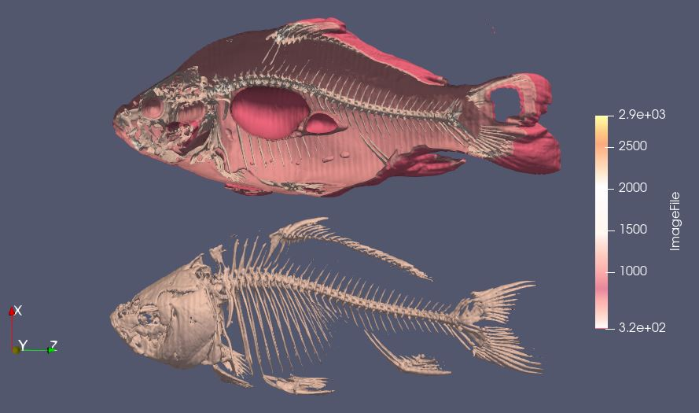
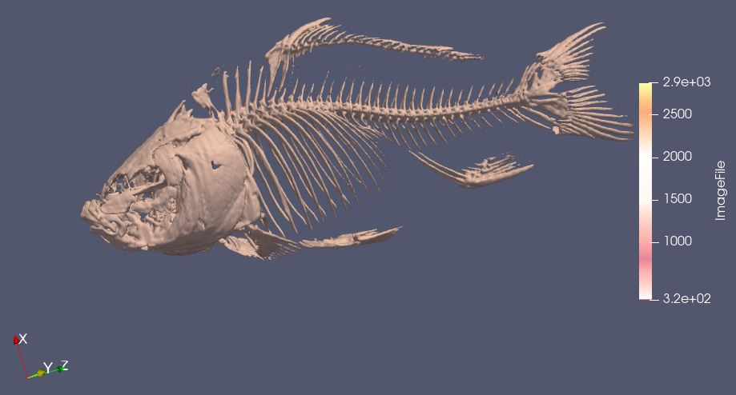
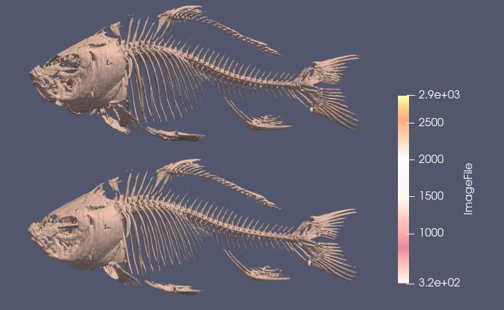
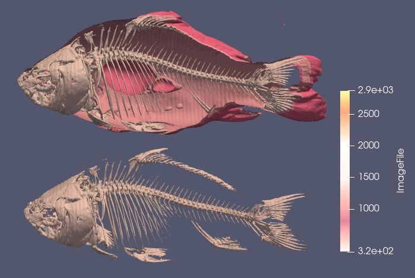

# Aim
The aim of this visualization is to explore the given data using techniques of volumne visualization to find interesting and meaningful visualization. 

# Visual Design Type
Volume Visualization showing the object within the raw dataset `data2`.

# Visualization

Volume render of an object(fish) showing the inner skeleton with the outer body. Also an cross-section of fish to relate the position of carcus with the body.

# Visual Mappings
## Legends

 

 | Mapping  | Range |
| ------------- |:-------------:| 
 | Bone |  |
 | Flesh  |  |
 | Outer Skin  |  |

  

## Color Map
A custom color map has been used in this visualizaton. Following are the settings for the preset

| No | Value | R | G | B|
|-------------|-------------|-------------|-------------|-------------|
| 1 | 319 | 1| 0.435 | 0.5568 |
| 2 | 319 | 1| 1 | 1 |
| 3 | 800.509 | 0.9098 | 0.525 | 0.6078 |
| 4 | 1450.55 | 1 | 0.9098 | 0.945 |
| 5 | 2020.33 | 1 | 1 | 1 |
| 6 | 2871 | 0.9843 | 1 | 0.6705 |

 

Opacity Transfer function values

 | Value  | Opacity |
 | ------------- |:-------------:| 
 | 319 | 0.45 |
 | 1956.13  | 0.3812 |
 | 2871  | 1 |

  

# Data Preparation 

We need to explore the dataset and find the hidden pattern in it. We take the below steps to achieve this.
1. Load the dataset` data2` and specify the Data Extent in properties window with respresentation as `Surface`. The values used for Data Extent as listed below.
 

    | Property | Value: |
    | ------------- |:-------------:| 
    | X | 255 |
    | Y | 255 |
    | Z | 511 |
    | Read As Image Stack | Y |

 
produced the below image

2. Since the previous step didn't show much of object. We will apply the `Contour filter` to find the iso surfaces in the dataset with a `Linear Series` of `10 data points` with range `[0,2871]`, however this would result in a very noisy result which need to be filtered further. A short summary below of the setting is below.
`Colormap` used is `X Ray` preset.
 

    | Property | Value |
    | ------------- |:-------------:| 
    | Sample size | 10 |
    | Range | 0 - 2871 |
    |  Type | Linear |
    |  Compute Normals | Y |
    |  Compute Gradients | N |
    |  Compute Scalars | Y |
    |  Compute Triangles | Y |
    |  Representation | Surface |
    | Data Axes Grid | N |

 

produced the below image

3. Now that we have the subject visible as now need to explore the inner parts of the subject to reveal more details. We use the `Threshold filter` to find out the scalar which lie in the range(1000-3000), this parameter needs to be selected carefully yo obtain the desired result. 
 

    | Property | Value |
    | ------------- |:-------------:| 
    | Scalars | ImageFile |
    | Minimum | 1000 |
    |  Maximum | 3000 |
    |  All Scalars | Y |
    |  Use Continious Cell Range | N |
    |  Invert | N |
    |  Representation | Surface |
 
produced the below image

4. To do a more comprehensive comparision we make a copy of the object just below it using the `Transform filter` with the below settings.

 

| Property        | Value     |      
| ------------- |:-------------:| 
| Show Box   | N | 
| Parameters   |  <table><tr> <td>Translate</td><td>(-220, 11.98, 0)</td></tr><tr> <td>Rotate</td><td>(0,0,0)</td></tr><tr> <td>Scale</td><td>(1, 0.945, 1)</td></tr></table> |
| Translation   | Y | 
| Scaling   | Y | 
| Rotation   | Y | 
| Face Movement   | Y | 
 

and produced the below image

5. Finally we apply a `Clip filter` on the `Contour filter` which will be applicible on the top object to get a cross-section of the fish and get a clear view of the relationship between the carcus and the flesh body. Settings for the clip filter are below.

 

| Property        | Value     |      
| ------------- |:-------------:| 
| Clip type   | Plane | 
| Show Plane   | N | 
| Parameters   |  <table><tr> <td>Origin</td><td>(131.35, 147.435, 248.45)</td></tr><tr> <td>Normal</td><td>(-0.046,0.955,0.2901)</td></tr><tr> </table> |
| Invert   | Y | 
| Crincle Clip   | N | 
 

and produced the below image

# Improvements
1. This visualization is limited to the representation of object in the dataset.
2. It could be better visualized with the data about the organs of the fish.