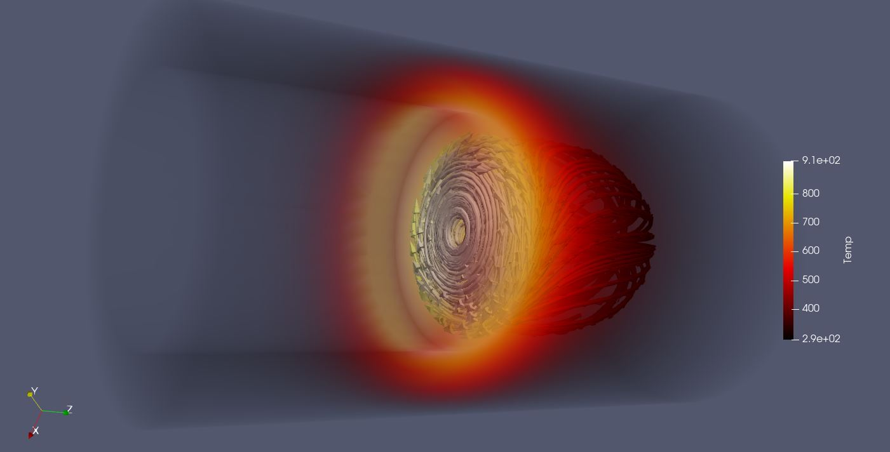
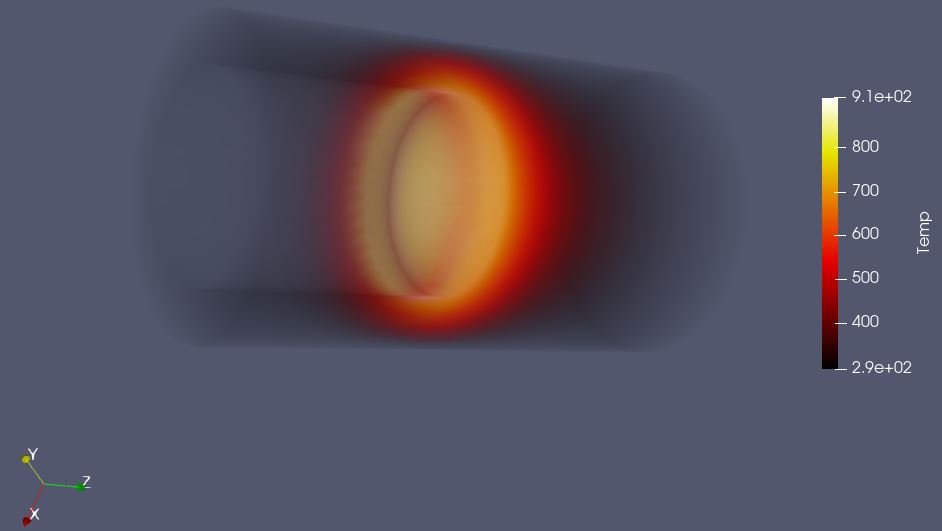
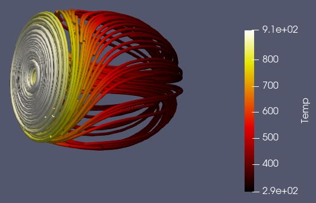
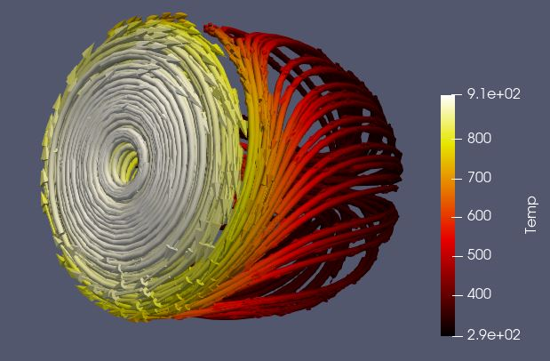

# Aim
The aim of this visualization is to explore the given data using techniques of volumne visualization to find interesting and meaningful visualization. 

# Visual Design Type
Volume Visualization showing the object within the preloaded example dataset `disk_out_ref.ex2`.

# Visualization

1. Volume render of an Tube in which possibly a liquid is flowing, showing the `relationship between the velocity and temperature` as the liquid moves through the tube. 
2. It is quite evident from the image as the liquid flows through the tube, it's temperture increases rapidly.

# Visual Mappings
## Legends

 

 | Mapping  | Range |
 | ------------- |:-------------:| 
 | High temp |  |
 | Medium Temp  |  |
 | Low Temp  |  |

  

## Color Map
This Visualization uses a `Black body raidtion` color pallete from the default set of presets.

# Data Preparation 

We need to explore the dataset and find the hidden pattern in it. We take the below steps to achieve this.
1. Load the dataset `disk_out_ref.ex2` with respresentation as `volume`. Select all variables from the properties list.
2. select `Temp` as color from the `Coloring` section in properties.

produced the below image

3. Liquid is flowwing in the center of the tube, we need to map the temperature of the liquid while it flows through the channel.
    - We trace the flow of liquid with `Stream Tracer filter`, which will give us the flow lines of the liquid. Settings for velocity tracer are below
     

    | Property | Value |
    | ------------- |:-------------:| 
    | Vectors | V |
    | Seed Type | Point Cloud |
    |  Coloring | Temp |
    |  Representation | Surface |
    |  Show sphere | N |

     

4.  The lines with stream tracer filter are vey thin and hard to work with, hence we convert them in to tubes by using a `Tube filter`.

    which gives us an image like 
    
    
    
5. Once we have the lines we need to convert them to vectors to determine the flow of liquid. So we use the `Glyph filter` to add the vectors. This gives us the vectors tanget to the flow of liquid, depciting direction of flow of liquid. Settings for the Glyph filter are listed below
     

    | Property | Value |
    | ------------- |:-------------:| 
    | Orientation Array | V |
    | Scale Array | V |
    |  Scale factor | 0.0919 |

     

    producing an image such as below

    

6. Finally we enable the view for 
    - data load from file which present the volume render for the tube
    - Tube filter which gives us the lines
    - Glyph filter which tells us the direction of flow of liquid.

which gives us the complete image giving the relationship between the velocity and temperature. 
and produced the below image

# Improvements
1. This could have been better visualized with a flow animation.
2. The flow is interupted at the junction where it meets the tube, and it then flows back, this can be explored more to understand how it disrupts the incoming flow.