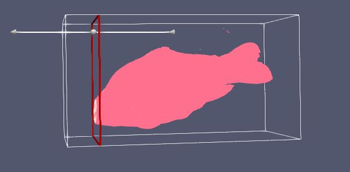

# Aim
The aim of this visualization is to explore the given data using techniques of volumne visualization to find interesting and meaningful visualization. 

# Visual Design Type
Volume Visualization showing the object within the raw dataset `data2`.

# Visualization

Volume Visualization showing an animation of the different cross-section of the obejct(fish).

# Visual Mappings
## Legends

 

 | Mapping  | Range |
| ------------- |:-------------:| 
 | Bone |  |
 | Flesh  |  |
 | Outer Skin  |  |

  

## Color Map
A custom color map has been used in this visualizaton. Following are the settings for the preset

| No | Value | R | G | B|
|-------------|-------------|-------------|-------------|-------------|
| 1 | 319 | 1| 0.435 | 0.5568 |
| 2 | 319 | 1| 1 | 1 |
| 3 | 800.509 | 0.9098 | 0.525 | 0.6078 |
| 4 | 1450.55 | 1 | 0.9098 | 0.945 |
| 5 | 2020.33 | 1 | 1 | 1 |
| 6 | 2871 | 0.9843 | 1 | 0.6705 |

 

Opacity Transfer function values

 | Value  | Opacity |
 | ------------- |:-------------:| 
 | 319 | 0.45 |
 | 1956.13  | 0.3812 |
 | 2871  | 1 |

  

# Data Preparation 

We need to explore the dataset and find the hidden pattern in it. We take the below steps to achieve this.
1. Load the dataset` data2` and specify the Data Extent in properties window with respresentation as `Surface`. The values used for Data Extent as listed below.
 

    | Property | Value: |
    | ------------- |:-------------:| 
    | X | 255 |
    | Y | 255 |
    | Z | 511 |
    | Read As Image Stack | Y |

 
produced the below image

2. Since the previous step didn't show much of object. We will apply the `Contour filter` to find the iso surfaces in the dataset with a `Linear Series` of `10 data points` with range `[0,2871]`, however this would result in a very noisy result which need to be filtered further. A short summary below of the setting is below.
`Colormap` used is `X Ray` preset.
 

    | Property | Value |
    | ------------- |:-------------:| 
    | Sample size | 10 |
    | Range | 0 - 2871 |
    |  Type | Linear |
    |  Compute Normals | Y |
    |  Compute Gradients | N |
    |  Compute Scalars | Y |
    |  Compute Triangles | Y |
    |  Representation | Surface |
    | Data Axes Grid | N |

 

produced the below image

3. Once we have the model for fish ready, we need to get multiple slices inorder to get an cross-section animation. 
- Add a `Clip filter` and and position the clipping plane at the start of the fish on z-axis by applying the below settings to get the clips.
 
| Property        | Configuration     |      
| ------------- |:-------------:| 
| Clip type   | Plane | 
| Show Plane   | Y | 
| Invert   | Y | 
| Representation   | Wireframe | 
| Crinkle clip  | Y | 
| Parameters   |  <table><tr> <td>Origin</td><td>`(50.70, 53.82, 51.63)`</td></tr><tr> <td>Normal</td><td>`(0.0066,-0.00713,-0.999)`</td></tr><tr> </table> |

- Add animation view from the top menu bar, view -> Animation view. We need to add clips on the animation veiw that would apply `clips at different interval` and keep clipping the fish along `z-axis`.

| Property        | Configuration     |      
| ------------- |:-------------:| 
| Type   | Clip1 |
| Property   | Clip1 - Clip Type - origin (2) | 

- Double click on the empty keyframes and add keyframes, that would clip the fish at specified time interval and display the clip selection.

| Property        | Configuration     :|      
| ------------- |:-------------:| 
| data representation   | wireframe | 
| Keyframes | `[ 24, 28.101, 32.203, 56.812, 64.265, 71.718, 79.171, 86.825, 90.135, 94.078, 97.804, 101.531, 116.43, 120.164, 123.890, 131.343, 146.25, 161.156, 168.609, 176.0625, 190.96, 205.875, 213.328, 220.781, 228.234, 243.140, 250.593, 265.5, 272.95, 280.40, 310.21, 317.67, 340.031, 362.3990, 377.296, 392.203, 407.109, 429.46, 459.28, 474.18, 496.546, 504  ]`    | 
| TIme | `[ 0, 0.093, 0.187, 0.75, 0.93, 1.125, 0.6315, 1.5 , 1.68, 1.78, 1.875, 2.25, 2.343, 2.43, 2.625, 3, 3.375, 3.75, 4.12, 4.5, 4.68, 4.87, 5.062, 5.25, 5.437, 5.625, 6, 6.187, 6.375, 7.125, 7.312, 7.5, 7.875, 8.25, 8.437, 8.62, 8.812, 9 , 9.187, 9.375, 9.56, 9.75, 10.125, 10.5, 11.25, 11,625, 11.812, 12  ]`    | 
| Mode | Sequence |
| Start Time| 0 |
| End Time| 12 |
| No. Frames | 20 |

this will produce a picture like below

# Improvements
1. This visualization is limited to the representation of object in the dataset.
2. It could be better visualized with the data about the organs or viens of the fish.